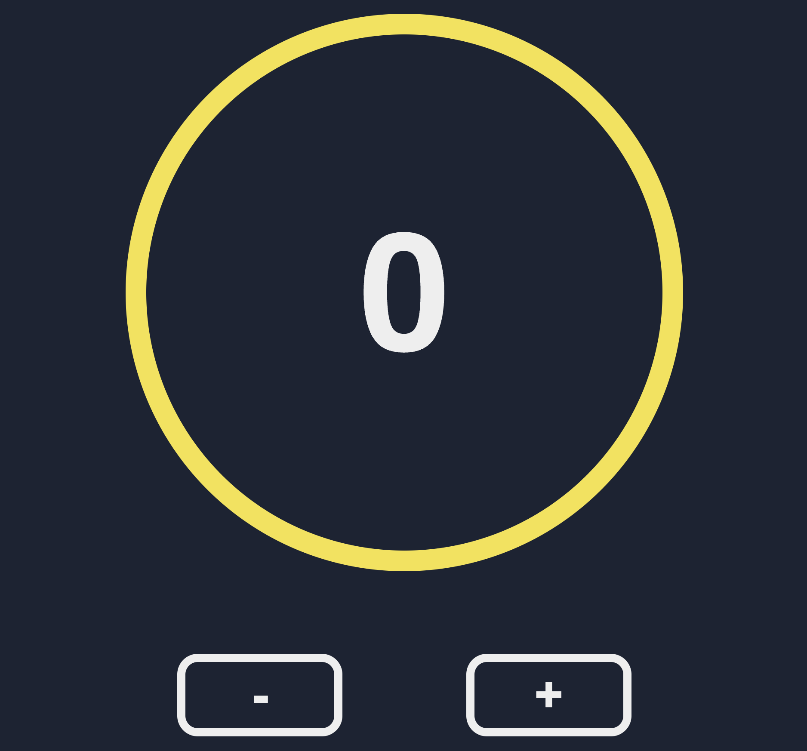
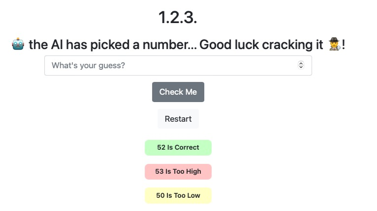
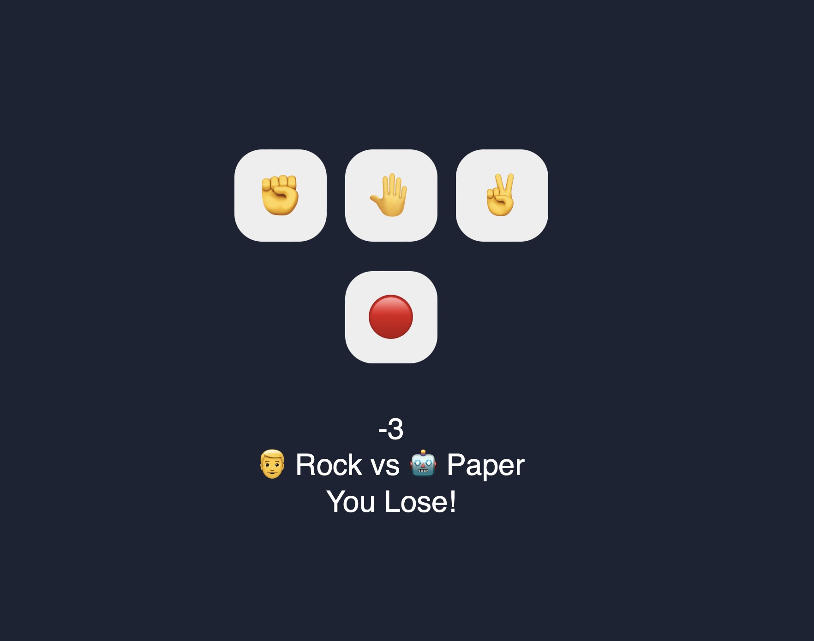
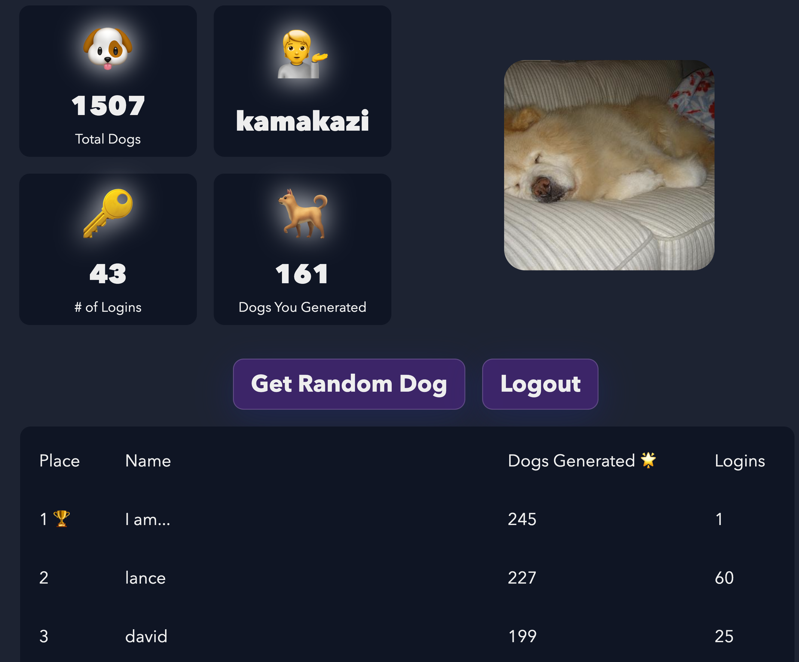

# Welcome to the Best Python Tutorial in the World by Clever Programmer 🚀

Below I'll list out all of the notes, exercises, 
and projects so they are easier to access for you 
throughout this course.

You'll be able to access all of the future projects 
and exercises from this main dashboard

# Projects 👇
### 👨‍💻 Counter App


Before you start this project make sure you've 
mastered the following **pure python** concepts...👇

*It's okay if you don't know the web development concepts...
We'll learn those together.*
#### Concepts Covered
| Web Development | Pure Python |
| --- | ----------- |
| *Routing* |  Dictionaries
| *GET Requests* | Named Arguments
| *Database*  | Incrementing / Decrementing
|              | Functions

#### Links
| [👨‍💻 Project](https://replit.com/@cleverprogrammer/exercise-counter-app) | [🚀 Live Demo](https://solution-counter-app.cleverprogrammer.repl.co) | [🔑 Solution](https://replit.com/@cleverprogrammer/solution-counter-app)
| ---- | ----- | ----

---- 

### Guess the Number Game


Before you start this project make sure you've 
mastered the following **pure python** concepts...👇

*It's okay if you don't know the web development concepts...
We'll learn those together.*
#### Concepts Covered
| Web Development | Pure Python |
| --- | ----------- |
| *Routing* |  String Formatting
| *GET Requests* | Functions
|*POST Requests*| Random / Import Modules
|| Databases

#### Links
| [👨‍💻 Project](https://replit.com/@cleverprogrammer/exercise-flask-guess-the-number) | [🚀 Live Demo](https://solution-flask-guess-the-number.cleverprogrammer.repl.co) | 🔑 [Solution](https://replit.com/@cleverprogrammer/solution-flask-guess-the-number)
| ---- | ----- | ------

----

#### 👨‍💻 YouTube App


Before you start this project make sure you've 
mastered the following **pure python** concepts...👇

*It's okay if you don't know the web development concepts...
We'll learn those together.*
#### Concepts Covered
| Web Development | Pure Python |
| --- | ----------- |
| *GET Requests* |  Dictionaries
| *Macros* | Named Arguments
|  Markup Filters      | Functions
|              | Lists of Dictionaries

#### Links
| [👨‍💻 Project](https://replit.com/@cleverprogrammer/exercise-api-youtube-app#main.py) | [🚀 Live Demo](https://solution-api-youtube-app.cleverprogrammer.repl.co/) | [🔑 Solution](https://replit.com/@cleverprogrammer/solution-api-youtube-app#main.py)
| ---- | ----- | ----

---- 

### Rock Paper Scissors


Before you start this project make sure you've 
mastered the following **pure python** concepts...👇

*It's okay if you don't know the web development concepts...
We'll learn those together.*
#### Concepts Covered
| Web Development | Pure Python |
| --- | ----------- |
| *Routing* |  Functions
| *GET Requests* | Conditionals (if elif)
|*POST Requests*| Random
||String Formatting
|| Databases
||Routing

#### Links
| [👨‍💻 Project](https://replit.com/@cleverprogrammer/exercise-flask-rps) | [🚀 Live Demo](https://solution-flask-rps.cleverprogrammer.repl.co) | 🔑 [Solution](https://replit.com/@cleverprogrammer/solution-flask-rps)
| ---- | ----- | ------

----

### Random Dog Generator


Before you start this project make sure you've 
mastered the following **pure python** concepts...👇

*It's okay if you don't know the web development concepts...
We'll learn those together.*
#### Concepts Covered
| Web Development | Pure Python |
| --- | ----------- |
| *Routing* |  Dictionaries
| *GET Requests* | Named Arguments
| *Database*  | Incrementing / Decrementing
|              | Functions

#### Links
| [👨‍💻 Project](https://replit.com/@cleverprogrammer/exercise-flask-get-random-dog) | [🚀 Live Demo](https://solution-flask-get-random-dog.cleverprogrammer.repl.co) | 🔑 [Solution](https://replit.com/@cleverprogrammer/bts-flask-get-random-dog)
| ---- | ----- | ------

----

### Here are the cheat sheet / notes

### 🏗️ Data Structures

#### 🔠 Variables

Basic method to assign values to a variable 👇🏻
```
name = 'Rafeh Qazi'
age = 25


>>> print(name)
>>> print(age)

Rafeh Qazi
25
```

More ways to assign values to variables 👇🏻
```
width, height = 400, 500

>>> print(width)
>>> print (height)

400
500
```

#### 📥 Taking Inputs

You have to assign the value of your input directly to a variable.

```
your_name = input('Please enter your name:')
print('Hi ' + your_name)

>>> Please enter your name:
>>> Rafeh 

Hi Rafeh

```

### 🐍 Data Types

#### 🪢 Strings

Strings can be etither words or sentences (and even numbers somtimes)

```
name = 'Rafeh'
country = 'USA'
city = 'Los Angeles'
```

#### 💯 Numbers

There are two number data types 👇🏻

🧱 Integers

```
age = 28
weight = 146

```

🏖️ Float
```
temperature = 65.3
longBeachToLAX = 20.7
```

#### 💡 Booleans

Indicates whether somethin is true or false.

```
isMyNameQazi = true
doIHaveAPlaystation = false

```

#### 📝 Lists

Similar to array in JavaScript, but Python uses the word 'Lists'.

```
fruits = ['🍎', '🍊', '🍌', '🍇', '🍑']

```

### 👨🏻‍🔬 Math Operators

Math Operators are used to do mathematical calculations within your application.

#### ➕ Addition 

Adding two or more numbers.

```
print(5 + 5)
>>> 10

num1 = 6
num2 = 7

print(num1 + num2)
>>> 13
```

#### ➖ Subtraction

Subtracting two or more numbers.

```
print(6 - 2)
>>> 4

num1 = 8
num2 = 3

print(num1 - num2)
>>> 5
```

#### ✖️ Multiplication

Multiplying two or more numbers.

```
print(6 * 2)
>>> 12

num1 = 8
num2 = 3

print(num1 * num2)
>>> 24
```

#### ➗ Division

Dividing two or more numbers.

```
print(6 / 2)
>>> 3

num1 = 24
num2 = 6

print(num1 / num2)
>>> 4
```

#### 🌫 Floor Division

Rounds the result down to the nearest whole number

```
print(5 // 2)
>>> 3
```

#### 📈 Exponentiation 

Multiplies the first number with an exponent equal to the second number.

```
print(6 ** 2) 
# similar to 6*6
>>> 36

num1 = 2
num2 = 6

print(num1 ** num2) 
# similar to 2*2*2*2*2*2
>>> 64
```

#### 🍪 Modulus

Gives the remainder from the division.

```
print(5/2)
>>> 1

print(14/3)
>>> 2
```

### 🤔 Comparison Operators

Comparison Operators are used to compare variables, etc. within your application.

####  1️⃣ Is Equal to '=='

Compare if two values are equal and return a boolean.
```
qaziAge = 28
davidAge = 23

print(qaziAge == davidAge)
>>> False

internetSpeedInLA = 100
internetSpeedinDubai = 100

print(internetSpeedInLA == internetSpeedinDubai)
>>> True

```

#### 2️⃣ Is Less than '<'

```
qaziAge = 28
davidAge = 23

print(davidAge < qaziAge)
>>> True

longBeachWeather = 66
sanFranciscoWeather = 57

print(longBeachWeather < sanFranciscoWeather)
>>> False
```

#### 3️⃣ Is Greater than '>'

```
qaziAge = 28
davidAge = 23

print(davidAge > qaziAge)
>>> False

longBeachWeather = 66
sanFranciscoWeather = 57

print(longBeachWeather > sanFranciscoWeather)
>>> True
```

#### 4️⃣ Is Less Than or Equal '<='

```
print(5 <= 5)
>>> True

print(4 <= 5)
>>> True

print(6 <= 5)
>>> False
```

#### 5️⃣ Is Greather Than or Equal '>='

```
print(6 >= 6)
>>> True

print(7 >= 6)
>>> True

print(5 >= 6)
>>> False
```

### [📚 Dictionaries](https://replit.com/@cleverprogrammer/Python-Tutorial-by-Clever-Programmer#cheat_sheet/lesson_dictionary.py)
```
def introducer():
  person = {
    'name': 'Qazi', 
    'shirt': 'Black', 
    'laptop': 'Apple',
    'phone_number': '224-123-3456',
    'assets': 100,
    'debt': 50,
    'favoriteFruits': ['🍎', '🍌', '🍊'],
    'netWorth': lambda: person['assets'] - person['debt']
  }
  
  person['shirt'] = 'Orange'
  person['assets'] = 1000
  print(f"👋 Hi my name is {person['name']}, 
  \n👕 I am wearing a {person['shirt']} shirt, \n👨‍💻 and the laptop I use to code is an {person['laptop']}, \n💰and my net worth is ${person['netWorth']()} USD, \n🥝My favorite fruits are {person['favoriteFruits']}")
  
>>> introducer()

`👋 Hi my name is Qazi, 
👕 I am wearing a Orange shirt, 
👨‍💻 and the laptop I use to code is an Apple, 
💰and my net worth is $950 USD, 
🥝My favorite fruits are ['🍎', '🍌', '🍊']`
```

### 🤔 Conditionals (if else)
```
def weather_to_emoji(weather: str) -> None:
  if weather == 'rain':
    print('☔')
  elif weather == 'cloudy':
    print('🌩️')
  elif weather == 'thunderstorm':
    print('⛈️')
  else:
    print('😎')
  
>>> weather_to_emoji('rain')
'☔'
```

### 🍬 For Loops
#### Example #1: Double Numbers in a List
```
def double(numbers: list) -> list:
  result = []
  for number in numbers:
    result.append(number * 2)
  return result

>>> double([1, 2, 3, 4, 5])
[2, 4, 6, 8, 10]
```

#### Example #2: Find the Max in a List
```
def find_max(numbers):
  current_max = numbers[0]
  for number in numbers:
    if number > current_max:
      current_max = number

  return current_max

>>> find_max([1, 2, 3, 10, 17, 4, 5, 6])
17
```

#### Example #3: Find the Frequency of Words in a Phrase
```
def word_frequency(phrase):
  result = {}
  words = phrase.split()
  for word in words:
    if word not in result:
      result[word] = 1
    else:
      result[word] += 1

  return result

>>> word_frequency('I love Batman because I am Batman')
{'I': 2, 'love': 1, 'Batman': 2, 'because': 1, 'am': 1}
```

### SPECIAL BUILT-IN FUNCTIONS with Python
```
>>> sum([1, 2, 3])
6
>>> len([1, 2, 3])
3
>>> max([1, 2, 3])
3
>>> max([1, 2, 3, 10, 5, 7])
10
>>> min([1, 50, -7, 337])
-7
```

### 🏗️ Functions

#### 1️⃣ Basic Function without any arguement.

```
def say_my_name():
    print('Rafeh Qazi')
    print('John')
    print('Kara')
    print('Sam')

say_my_name()
>>> Rafeh Qazi
>>> John
>>> Kara
>>> Sam
```

#### 2️⃣ Function with one arguement.

```
def say_my_name(name):
    print(name)


say_my_name('Rafeh')
>>> Rafeh
```

#### 3️⃣ Function with multiple arguements and a default arguement

```
def greeting(name, greet='aloha'):
  # Function greeting() takes in 2 arguments, 'name' & 'greet' and it greets the user.

>>> greeting('aloha', 'Qazi')
"👋 aloha Qazi!"
    
print(f"👋 {greet} {name}!")

# Positional arguments 👇🏻
# greeting('Qazi', 'hello')

# Named arguments 👇🏻
# greeting(greet='Hi', name='Qazi')

```